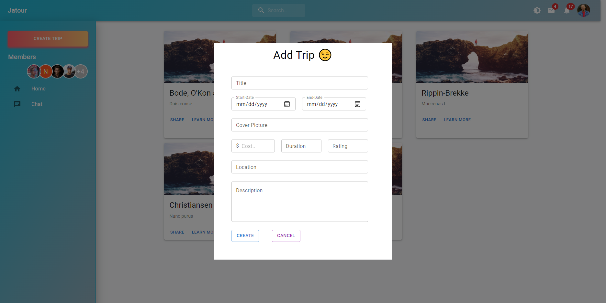

# JATOUR 2.0

Full complete End-to-End Trip social media app.

<div align="center">
    
</div>

### Built with

The section list major framework/libraries used in the project.

- Reactjs
- Material UI
- MobX (state management)
- .Net Core (backend API)
- JWT token Authentication

### Installation

1. Clone the repo

```
    git clone https://github.com/bahkali/Jatour-2.git
```

2. Navigate into the clientApp folder and install react packages

```
 npm install
```

### License

[License](./LICENSE) Distributed under the MIT License.
